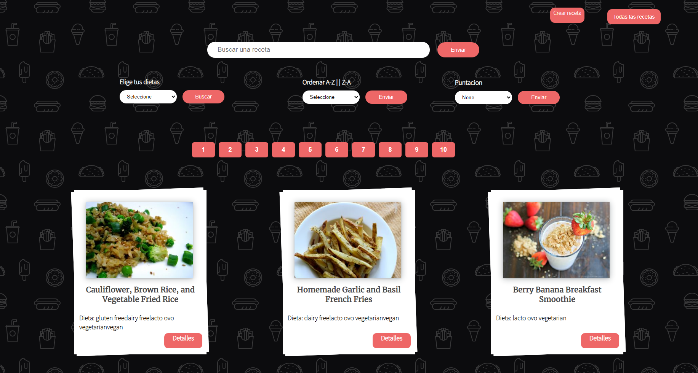
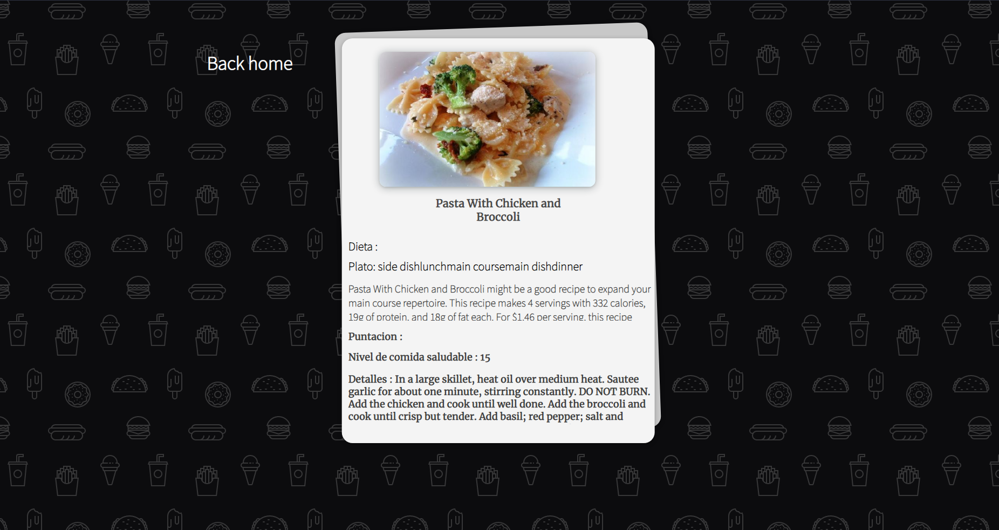
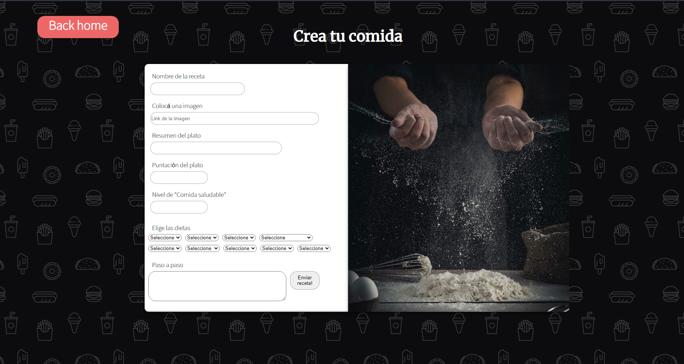

URL :  https://webfoodst.vercel.app/
 
Proyecto: Año 2021
 
Desarrollo de un SPA (Single Page Application) Utilizando React para el Front End y Redux como state management. Todos los componentes fueron desarrollados con css sin uso de librerías externas.
La SPA consume datos de una API (Spoonacular) a través del Back End desarrollado en Node.JS
utilizando Express, agregando nuevas funcionalidades a la API original.
Algunos features del proyecto : Cache de búsquedas, ordenamiento y filtros, formulario controlado para la creación de recetas.

 

 

 

